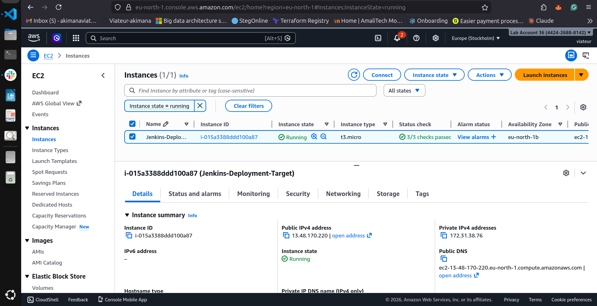
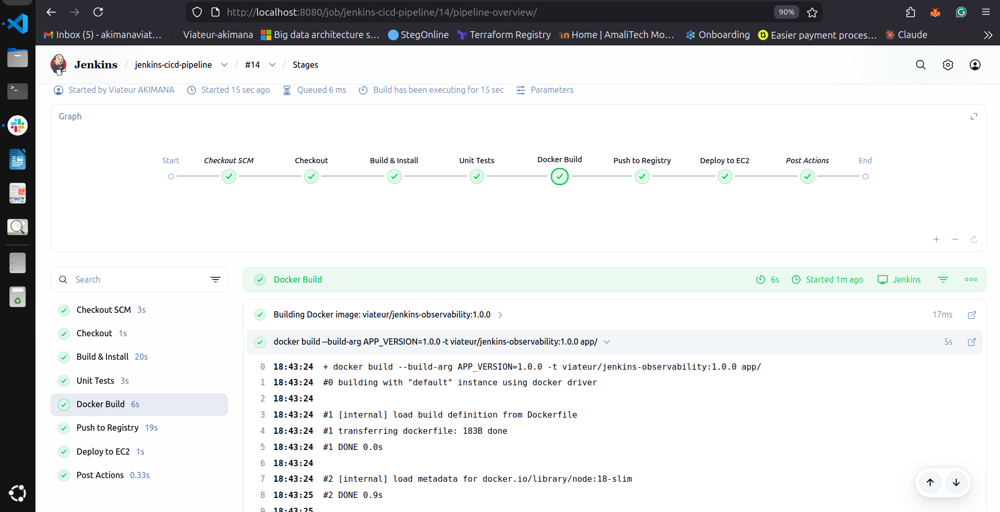
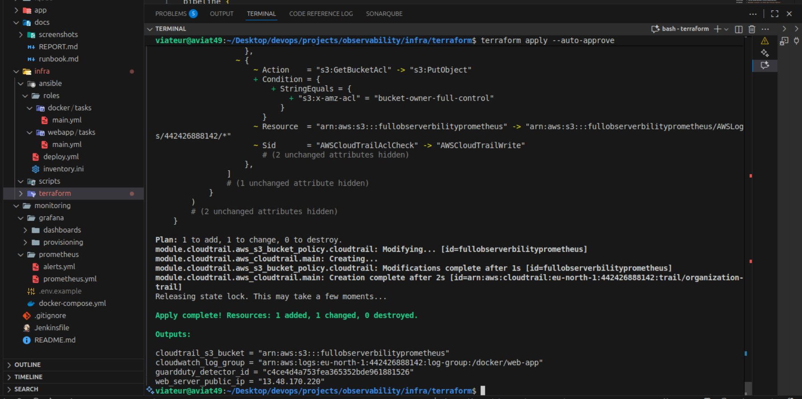
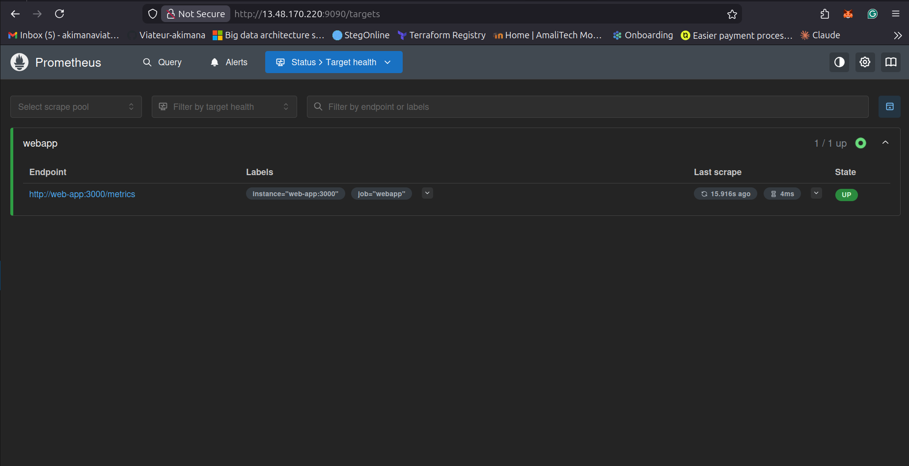
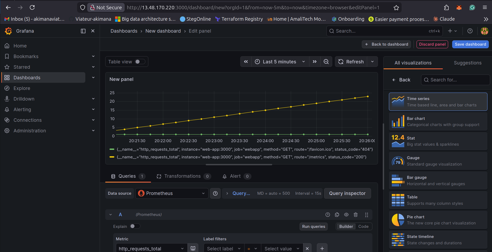
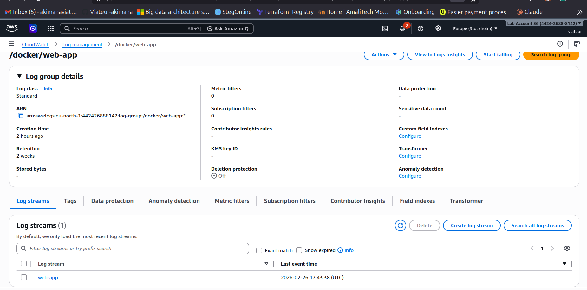

# Project 6 – Full Observability & Security Solution

## Overview

This project demonstrates a complete observability and security stack for a containerized web application, integrated with Prometheus, Grafana, and AWS Services.

##  Quick Start

1. Clone the repository:
	```bash
	git clone https://github.com/viateur-amalitech/Full-Observability-Security-Solution.git
	cd Full-Observability-Security-Solution
	```
2. Provision infrastructure:
	```bash
	cd infra/terraform
	terraform init && terraform apply -auto-approve
	```
3. Deploy monitoring stack locally:
	```bash
	cd monitoring
	docker compose up -d
	```
4. Access services:
	- Web App: `http://localhost:3000` (or EC2 public IP)
	- Prometheus: `http://localhost:9090`
	- Grafana: `http://localhost:3001` (admin/admin)
	- Metrics: `http://localhost:3000/metrics`

For full setup, CI/CD, and AWS integration, see [docs/runbook.md](./docs/runbook.md).

## Documentation

- [Runbook & Setup Guide](./docs/runbook.md)
- [Implementation Report](./docs/REPORT.md)
- [Screenshots](#screenshots)


## Key Implementations

- **Metrics**: Exposed at `/metrics` using `prom-client` in the Node.js application.
- **Monitoring**: Prometheus scraping app and Node Exporter metrics.
- **Visualization**: Grafana dashboard for Latency, RPS, and Error Rates.
- **Alerting**: Prometheus/Grafana alerts for high error rates (>5%).
- **Logging**: Docker logs streamed to AWS CloudWatch.
- **Security**: AWS CloudTrail (activity auditing) and AWS GuardDuty (threat detection) enabled.
- **Compliance**: CloudTrail logs stored in encrypted S3 buckets with lifecycle policies.

## Screenshots

This section provides visual documentation of all key components and their functionality:

### 1. Infrastructure & Deployment

#### AWS EC2 Instance

*Shows the deployed EC2 instance running the containerized application with proper security groups and configuration.*

#### Jenkins CI/CD Pipeline

*Demonstrates the complete CI/CD pipeline with Docker build, test execution, and Ansible deployment stages.*

#### Terraform Apply Process

*Shows the infrastructure provisioning process using Terraform with AWS resources creation.*

### 2. Monitoring & Observability

#### Prometheus Metrics Collection

*Displays Prometheus scraping configuration with active targets including the web application at `/metrics` endpoint.*

#### Grafana Dashboard - Web App Observability

*Shows the comprehensive observability dashboard with:*
- *Request Latency (p50/p90/p99 percentiles)*
- *Requests per Second (RPS) metrics*
- *Error Rate percentage monitoring*
- *Real-time performance visualization*

### 3. AWS Security & Compliance

#### CloudWatch Logs Integration

*Demonstrates Docker container logs streaming to AWS CloudWatch with proper log groups and retention policies.*

### Architecture Overview

The screenshots above demonstrate the complete observability and security stack:

1. **CI/CD Flow**: Code → Jenkins → Docker Hub → EC2 Deployment
2. **Monitoring Stack**: Application Metrics → Prometheus → Grafana Dashboards
3. **Security Layer**: CloudTrail Auditing + GuardDuty Threat Detection
4. **Compliance**: Encrypted S3 storage for audit logs

### Key Metrics Captured

Based on the Grafana dashboard configuration, the following metrics are monitored:

- **Latency Metrics**: `http_request_duration_seconds_bucket`
  - p50, p90, p99 percentile response times
- **Throughput Metrics**: `http_requests_total`
  - Requests per second calculation
- **Error Metrics**: `http_errors_total`
  - Error rate percentage (threshold: >5% triggers alerts)

### Access Information

When deployed, access the components at:
- **Web Application**: `http://<EC2_PUBLIC_IP>` (Port 80)
- **Prometheus**: `http://<EC2_PUBLIC_IP>:9090`
- **Grafana**: `http://<EC2_PUBLIC_IP>:3000` (admin/admin)
- **Application Metrics**: `http://<EC2_PUBLIC_IP>/metrics`

## Repository Structure

- **[app/](./app/)**: Node.js source code, tests, and Dockerfile.
- **[infra/](./infra/)**: Infrastructure as Code (Terraform) and Configuration (Ansible).
- **[monitoring/](./monitoring/)**: Prometheus and Grafana configurations + local `docker-compose.yml`.
- **[docs/](./docs/)**: Comprehensive report and screenshots.
- **[Jenkinsfile](./Jenkinsfile)**: Root pipeline definition.

## Components

- **Prometheus**: Port 9090
- **Grafana**: Port 3001 (Admin: `admin`/`admin`)
- **Node Exporter**: Port 9100
- **Web App**: Port 3000

## Deliverables Checklist

- [x] `prometheus.yml`
- [x] Grafana dashboard JSON
- [x] Functional alerts (>5% error rate)
- [x] CloudWatch Logs streaming
- [x] CloudTrail & GuardDuty enabled
- [x] encrypted S3 for logs
- [x] 2-page Implementation Report

- [x] Screenshots of all components

---

For detailed instructions, troubleshooting, and advanced deployment, see [docs/runbook.md](./docs/runbook.md).
